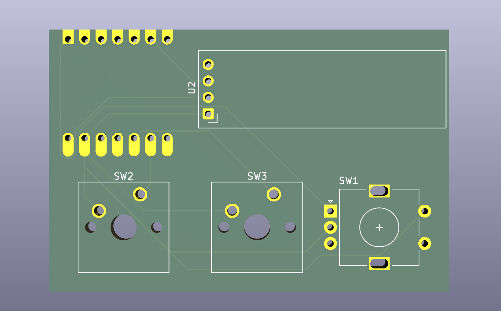
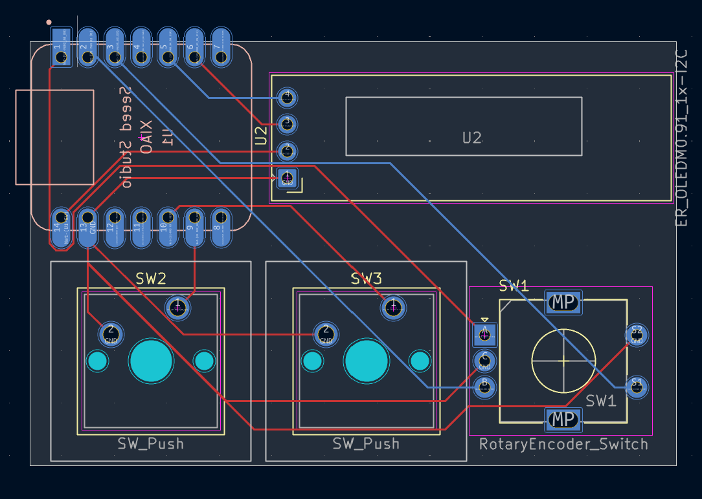
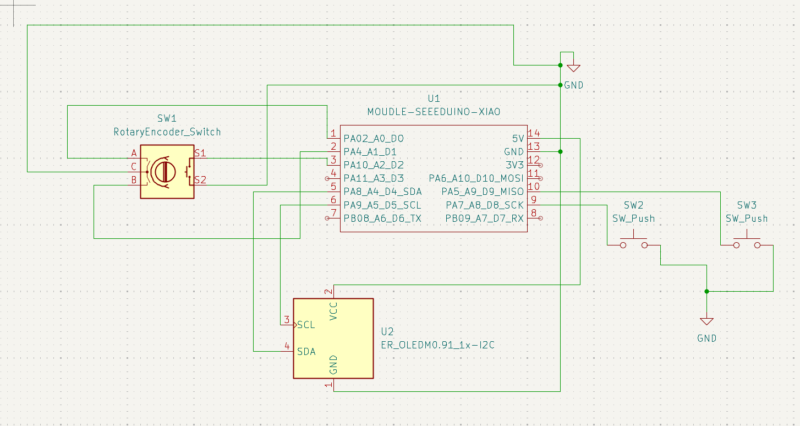
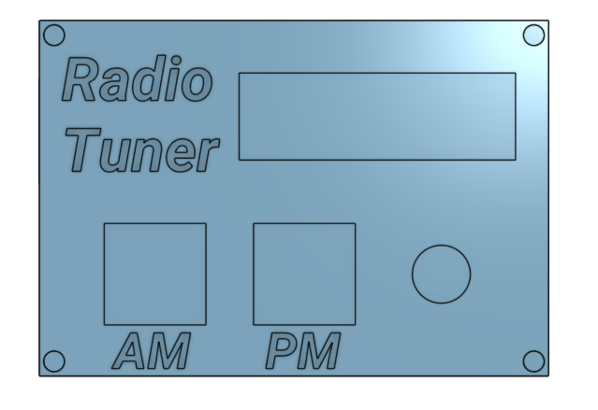
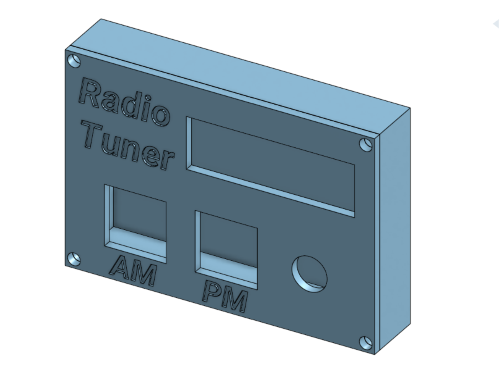

# Radio Tuner
A custom fidget-Hackpad! I designed the Radio Tuner so that I would have a little radio-tuning fidget wherever I went. Switching between AM and FM changes the target frequency, and the waveform allows you to tell how close you are getting to each target. The Radio Tuner features two push buttons, a 0.91 inch OLED, and an encoder. 

# PCB Design

The Radio Tuner was the first time I had ever created a PCB! To to the constraint of only having two layers, I initially struggled with getting all the ports connected. KiCad was also confusing to navigate. Thankfully, I didn't have a lot of inputs and outputs, and they were all really well documented. For my purposes, the two buttons are for switching between AM and FM radio, and the encoder is for setting the frequency. The OLED is for displaying all those settings and the waveform.

# CAD

The case for the Radio Tuner was very simple. I didn't bother using ai03, instead I just took measurements from KiCad. I made a case and a face. The case has a slot for the USB on the XIAO RP2040, and the face has holes for the keys, the OLED, and the encoder. The face also has engraved text, displaying the Radio Tuner's name and the function of each of the two buttons. 

# Firmware

The firmware was coded using blood, tears, and lots of online tutorials ToT since I don't have any experience nor have I yet received funding, I cannot personally offer any instructions on flashing firmware. 
